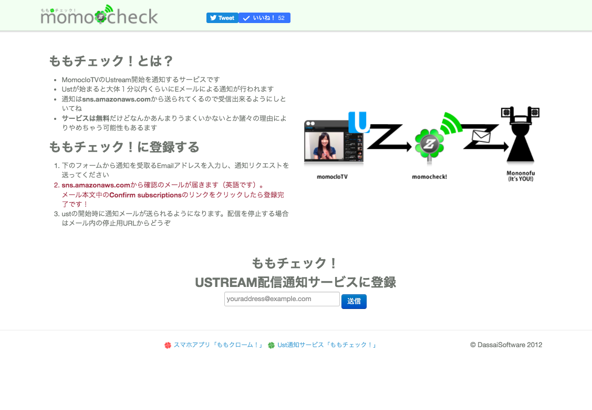
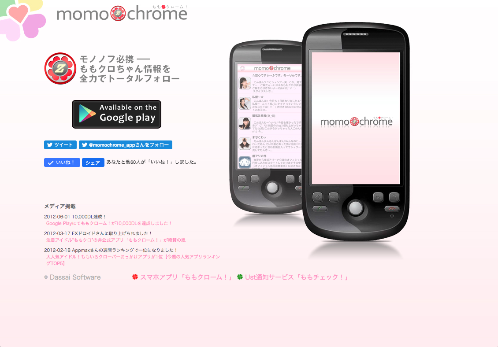
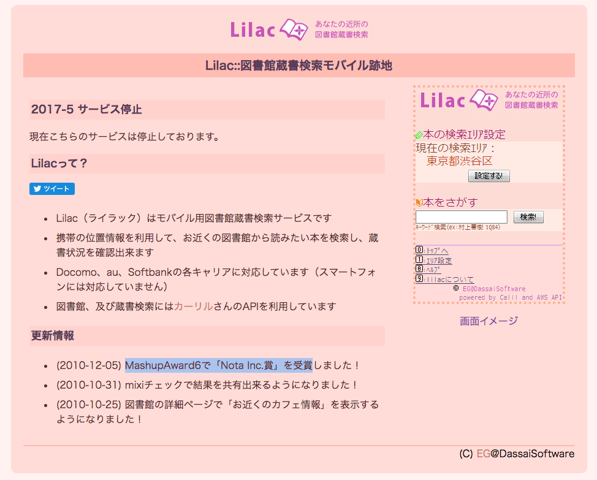

# egmc.me

## blog

 - https://dasalog.hatenablog.jp/

## social accounts

 - X(twitter): [egmc](https://x.com/egmc)
 - github: [egmc](https://github.com/egmc)
 - LinkedIn: https://www.linkedin.com/in/sohei-iwahori-704418b0/

## monitoring tools

### exporters

- [Sysload Exporter](https://github.com/egmc/sysload_exporter)
- [Systemd Resolved Exporter](https://github.com/egmc/systemd_resolved_exporter)

### grafana dashboards

- [process exporter dashboard with treemap](https://grafana.com/grafana/dashboards/13882)
- [sysload dashboard](https://grafana.com/grafana/dashboards/15014)

### PHP specific tools

- [PHP Dead Code Reporter](https://github.com/egmc/php-dcr)

## talks

- [本番環境でPHPコードに触れずに「使われていないコード」を調べるにはどうしたらよいか？ / PHPカンファレンス小田原2026](https://speakerdeck.com/egmc/ben-fan-huan-jing-dephpkodonihong-rezuni-shi-wareteinaikodo-wodiao-berunihadousitarayoika)
- [SREのためのeBPF活用ステップアップガイド / SRE NEXT 2025](https://sre-next.dev/2025/schedule/#slot072)
- [PHPアプリケーションにおけるeBPFの使い所 / eBPF Japan Meetup #1](https://ebpf.connpass.com/event/323368/)
- [Building Dashboards as a Hobby / Grafana Meetup Japan #1](https://grafana-meetup-japan.connpass.com/event/314500/)
- [Runbookに何を書き、どのようにアラートを振り分けるか？ / SRE NEXT 2023](https://sre-next.dev/2023/schedule/#jp066)
- [プロダクション環境の信頼性を損ねず観測する技術 / SRE NEXT 2022](https://sre-next.dev/2022/schedule/#jp32)
- [Practices for Making Alerts Actionable / SRE NEXT 2020](https://sre-next.dev/2020/schedule/#d3)

## workshop

 - [eBPFと周辺技術を利用してPHPアプリケーションコードを変更しない可視化をやってみる](https://fortee.jp/sessionless-conference-2024/proposal/0876d06f-a80f-405b-a89a-84ee7c1458ec)
   - [repo](https://github.com/egmc/php-sessionless-conference-ebpf-workshop)
   

## community activities

- eBPF Japan Meetup Organizer
- SRE NEXT 2025 Core Staff / Co-Chair
- SRE NEXT 2024 Core Staff
  
## services / apps

no longer available

 - 2012〜2018 / Web / Ust通知サービス / ももチェック！
 
 - 2012〜2018 / AndroidApp / ももいろクローバーZ非公式ファンアプリ / ももクローム！
 
    - 2012/03 http://exdroid.jp/d/32417/
 - 2010-10 〜 2017-05 / MobileWeb / モバイル用図書館蔵書検索サービス / Lilac
 

## maintaining sites

 - https://junsatsuma.com/
 - http://www.otsuka-new-corpo.com/ (archived)
