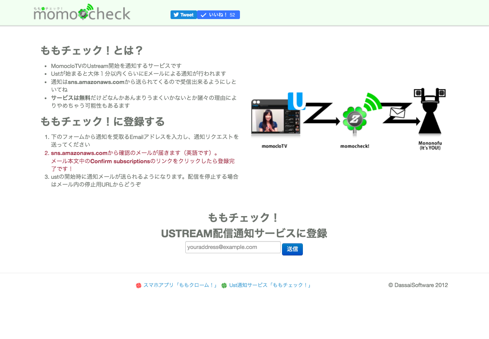

# egmc.me

## blog

 - https://dasalog.hatenablog.jp/

## social accounts

 - twitter: [egmc](https://twitter.com/egmc)
 - github: [egmc](https://github.com/egmc)
 - LinkedIn: https://www.linkedin.com/in/sohei-iwahori-704418b0/

## monitoring tools

### exporters

- [Sysload Exporter](https://github.com/egmc/sysload_exporter)
- [Systemd Resolved Exporter](https://github.com/egmc/systemd_resolved_exporter)

### grafana dashboards

- [process exporter dashboard with treemap](https://grafana.com/grafana/dashboards/13882)
- [sysload dashboard](https://grafana.com/grafana/dashboards/15014)

## talks

- [Practices for Making Alerts Actionable / SRE NEXT 2020](https://sre-next.dev/2020/schedule/#d3)
- [プロダクション環境の信頼性を損ねず観測する技術 / SRE NEXT 2022](https://sre-next.dev/2022/schedule/#jp32)
- [Runbookに何を書き、どのようにアラートを振り分けるか？ / SRE NEXT 2023](https://sre-next.dev/2023/schedule/#jp066)
- [Building Dashboards as a Hobby / Grafana Meetup Japan #1](https://grafana-meetup-japan.connpass.com/event/314500/)
- [PHPアプリケーションにおけるeBPFの使い所 / eBPF Japan Meetup #1](https://ebpf.connpass.com/event/323368/)

## services / apps

no longer available

 - 2012〜2018 / Web / Ust通知サービス / ももチェック！
 
 - 2012〜2018 / AndroidApp / ももいろクローバーZ非公式ファンアプリ / ももクローム！
 
    - 2012/03 http://exdroid.jp/d/32417/
 - 2010-10 〜 2017-05 / MobileWeb / モバイル用図書館蔵書検索サービス / Lilac
 

## maintaining sites

 - https://junsatsuma.com/
 - http://www.otsuka-new-corpo.com/ (archived)
